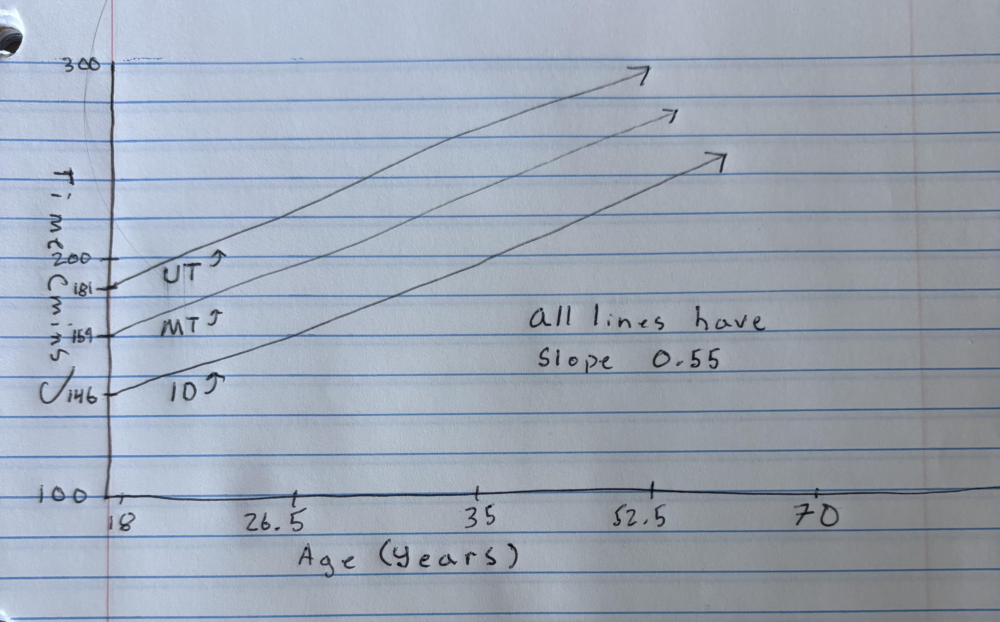

```{r setup1, include=FALSE}
knitr::opts_chunk$set(echo = TRUE)
options(show.signif.stars = FALSE)
```

## Instructions (READ CAREFULLY!)

- **Use the steps we discussed in class for working with .R and .Rmd files!** 

    - 0: make sure your .Rmd and .csv are in the same folder and your working directory is set to this folder. 
    - 1: copy appropriate code from the .R script file into the code chunks in the .Rmd file where prompted. Add comments to your code so you begin to learn what each command does! 
    - 2: run lines of code in each code chunk in the console to make sure you can generate the desired output. Use the output to answer the question and edit the .Rmd to reflect your answer 
    - 3: if needed change code chunk from `eval = FALSE` to `eval = TRUE` and knit your document. You should see any new output and your response in the updated knitted document! 
    - 4: move on to the next chunk 
    - 5: rinse and repeat 1-4 until you have completed the assignment! 
    
- **Include all generated plots to receive full credit for each question. If you are having trouble with knitting to .html, knit to word instead. All MSU students can download MS Office with office 365.** 
- **Be sure to bold your answers to questions where relevant, and write in complete sentences.** 
- **Answers to multiple choice questions may be indicated by typing "bolding" (putting double underlines) around the appropriate choice or typing a bold letter representing your choice below the question.** 
- **Spell check your RMD file by going to "edit-> check spelling." Also, be sure to proofread your knitted document to ensure all images and formatting are correctly implemented.** 
- **Once finished, submit your completed work to gradescope and BE SURE TO ASSIGN PAGES IN YOUR SUBMISSION TO EACH QUESTION OUTLINED IN THE GRADESCOPE ASSIGNMENT. IF YOU DO NOT SELECT PAGES, YOUR ASSIGNMENT WILL NOT BE GRADED! EXAMPLE HERE: [https://help.gradescope.com/article/ccbpppziu9-student-submit-work#submitting_a_pdf](https://help.gradescope.com/article/ccbpppziu9-student-submit-work#submitting_a_pdf)**
- ***Group work is encouraged! If you work in a group (of up to four people), please make sure ALL group member names are listed in line 3 and in the Gradescope submission! Each group only needs to submit one assignment to Gradescope.***

___PLEASE DELETE ALL INSTRUCTIONS BEFORE SUBMITTING YOUR ASSIGNMENT (lines 21-39). AND REMBER TO SELECT ALL PAGES ASSOCIATED WITH EACH RESPONSE :)___ 


## Background

For this homework we will revisit data from the 2024 Big Sky Biggie 30-mile Mountain bike race [https://bigskybiggie.com/](https://bigskybiggie.com/). Rather than investigate true mean race times across age groups, now we will investigate the relationship between total race time (min) and age (years). These data are provided on the course webpage as _big-sky-biggie_clean30.csv_. The variables in the data set are, 

- `Place`: Overall place in the race 
- `Name`: Participant's name
- `City`: Participant's home city 
- `State`: Participant's home state 
- `Gender`: Participant's gender (M, F)
- `Pace`: Average pace (mph)
- `age_group`: Participant's age group (18 and under, 19-29, 30-39, 40-49, 50+)
- `Bib`: Bib number 
- `Age`: Age in years 
- `mph`: Average miles per hour (mph)
- `tot_time`: Total time in minutes 
- `finish_time`: Time crossing the finish line (MST) 


__Research Question:__ You are tasked with investigating how total race time (mins) associates with increases in age for participants from Montana (MT), Utah (UT), and Idaho (ID). You should also investigate if the association between age and total race time _differs_ across the three different states ("MT", "UT", "ID").


## Appropriate modeling techniques and hypotheses


1. (4pts) Before even looking at any data, you can consider how you would address this research question with an MLR model (assuming none of the MLR assumptions are severely violated). _Describe the MLR model that allows you to address the research question in words (no notation necessary). Your description must include a specification of the response variable, the explanatory variables, and an explanation of why you will or will not consider an interaction between the explanatory variables._ 

- **The response variable is total race time (mins) and the explanatory variables are the age of participants, and their respective states(MT, UT, ID). We will consider an interaction between the state and age of participants, as the research question asks to investigate if the association between age an total race time differs across the different states. Total race time will be a function of a participants age, their state, and the interaction between the two.**

## Exploratory data analysis

```{r wrangle, message=F, warning=F, echo = FALSE}
## Code to read in data and keep only variables of interest 
library(tidyverse)

df_biggie30 <- read_csv("big-sky-biggie_clean30.csv")


df_biggie_sub <- df_biggie30 %>% 
  # filtering to states of interest
  filter(State %in% c("MT", "UT", "ID")) %>% 
  # removing observations with missing times and ages (i.e., DNF)
  filter(!is.na(tot_time) & !is.na(Age)) 

```

The code below will create three scatterplots of the same data. 
Plot A shows fitted lines that allow different slopes for each state, 
Plot B shows fitted lines that assume the same slope for all states, 
and Plot C shows the raw data faceted by state. Use these plots to address questions 2 and 3.

```{r scatterplot, message = F, warning = F, fig.height=8, fig.width=12, out.width = "0.75\\linewidth", echo = FALSE}

# If you get an error like "there is no package called 'moderndive'" or 'gridExtra',
# first run the following lines *once* in the Console (not in this chunk):
# install.packages("moderndive")
# install.packages("gridExtra")

library(moderndive)
library(gridExtra)
library(viridis)

p1 <- df_biggie_sub %>%
  ggplot(aes(x = Age, y = tot_time, col = State)) +
  geom_point(alpha = 0.6) +
  geom_smooth(method = "lm", se = TRUE) +  
  labs(
    title = "Plot A: Fitted Lines Allow Different Slopes for Each State",
    x = "Age (years)",
    y = "Total Time (sec)"
  ) +
  theme_bw() +
  scale_color_viridis_d()

p2 <- df_biggie_sub %>%
  ggplot(aes(x = Age, y = tot_time, col = State)) +
  geom_point(alpha = 0.6) +
  moderndive::geom_parallel_slopes(method = "lm") +
  labs(title = "Plot B: Fitted Lines Assume Same Slope for All States",
       x = "Age (years)",
       y = "Total Time (sec)") +
  theme_bw() +
  scale_color_viridis_d()


p3 <- df_biggie_sub %>%
  ggplot(aes(x = Age, y = tot_time, col = State)) +
  geom_point(alpha = 0.6) +
  facet_wrap(~ State) +
  labs(title = "Plot C: Faceted Raw Data",
       x = "Age (years)",
       y = "Total Time (sec)") +
  theme_bw() +
  scale_color_viridis_d()


# --- Combine into 2x2 grid (p3 across bottom) ---
gridExtra::grid.arrange(
  p1, p2,
  p3,
  ncol = 2,
  layout_matrix = rbind(
    c(1, 2),
    c(3, 3)
  )
)

```


2. (4 pts) Does assuming a linear association between total time and age seem reasonable for all three states? Explain why/why not referencing at least one feature of the plot(s) above. 

- __Idaho and Montana appear to have slight positive linear relationships between total time and age in plot A above. Utah's slope is flat in plot A and the raw data plot shows a small sample size with no visible linear relationship. Assuming a linear relationship for Idaho and Montana makes sense, while Utah does not show an apparent linear relationship.__


3. (4 pts) Using the plots above does it appear that the relationship between total time and age differs across states? Reference at least one feature of the plot(s) to explain your reasoning.  

- __Yes. In plot A, the slopes for each state are different, Idaho has the steepest positive slope and Montana has a slightly less steep positive slope. Utah's slope is slightly negative. The slopes of the lines vary across states, indicating the relationship between total time and age differs across the 3 states.__

4. (4 pts) The population model for the "separate lines model (interaction MLR model)" can be written as, 

$tot\_time_i=\beta_0+\beta_1Age_i+\beta_2I_{MT,i}+\beta_3I_{UT,i}+\beta_4(I_{MT,i}\cdot Age_i)+\beta_5(I_{UT,i}\cdot Age_i)+\epsilon_i$, where $\epsilon_i \sim N(0,\sigma^2)\ \text{for $i=1,2,...,206$}$

Define the indicator variables in the context of this problem. The code shown below lets you express the indicator variables as piecewise functions, just as we do in the notes. You may modify it by replacing the “?” with the appropriate group name; nothing else needs to be changed. 

$I_{MT}=   \left\{
\begin{array}{ll}
      1 & \text{if obeservation i is from Montana} \\
      0 & \text{else} \\
\end{array} 
\right.$

$I_{UT}=   \left\{
\begin{array}{ll}
      1 & \text{if observation i is from Utah} \\
      0 & \text{else} \\
\end{array} 
\right.$


5. (2 pts) In the population of riders, which coefficient(s) in this model allow for differences in the true change in the mean total time (minutes) for a 1-year increase in age across states (ID, MT, UT)?


    A. $\beta_0$   
    
    B. $\beta_1$
    
    C. $\beta_2$, $\beta_3$ 
    
    D. $\beta_4$, $\beta_5$  
    
    E. All of them
    
- __D__ 


## Estimation of model, assessment of assumptions, and summarizing results

6. (8 pts) Using the summary output created by the code chunk below, write the estimated regression equation for each state (ID, MT, UT). You defined indicator variables above, so you do not need to define them again here. Please round to 2 decimal places and show all of your work. You may use LaTeX (outlining your steps with bullets) or upload a neatly handwritten solution to this problem. _(Note: you can append your handwritten pdf to the pdf of this compiled document and then select the appropriate page as the answer to this question. Adobe (can download from MSU creative cloud) and Preview both provide tools for combining pdf documents)._ 

```{r q6-est-model}
fit_int <- lm(tot_time ~ Age * State, data = df_biggie_sub)
summary(fit_int)
```
- **ID = $tot\_time_i = 107.01 + 1.48(Age_i)$**

- **MT = $tot\_time_i = (107.01 + 53.06) + (1.48 - 0.95)(Age_i) = tot\_time_i = 160.07 + 0.53(Age_i)$**

- **UT = $tot\_time_i = (107.01 + 101.27) + (1.48 - 1.74)(Age_i) = tot\_time_i = 208.28 - 0.26(Age_i)$**


7. (8 pts) Run the code below to create diagnostic plots. Based on the residual diagnostic plots, complete the assessments of each modeling assumption (validity condition), referencing the appropriate plot. *potential strengths of evidence are provided in parentheses.*

```{r q7-diag, echo = FALSE, fig.width=12, fig.height=4, out.width=".99\\linewidth"}
par(mfrow = c(1,4))
plot(fit_int)
```


**Evidence against linearity:** __There is moderate evidence against the linearity assumption. In the residuals vs. fitted plot, the smooth line is not flat and curves twice, indicating moderate evidence of a linearity violation.__  (weak / moderate / strong)  

**Evidence against equal variance:** __There is weak evidence against the HOV assumption. In the residuals vs fitted and scale location plots, there is weak evidence suggesting fanning, funneling or another HOV violation.__  (weak / moderate / strong)  

**Evidence against normality:** __There is weak evidence of a violation of the normality assumption. In the Q-Q plot, the points follow the 1:1 line well and do not indicate a violation.__  (weak / moderate / strong)  

**Number of influential observations:** __There ar no influential points. None of the data falls within Cook's distance in the residuals vs leverage plot.__  (there are none / there is one / there is more than one)


8. (4 pts) A set of partial residual plots can be created using the code in the code chunk below. Create them and then bold the appropriate choice (options in [ ]) and finish for the following sentences. 

```{r q8-prp, fig.width=10, fig.height=4, out.width=".99\\linewidth"}
library(effects)
plot(allEffects(fit_int, residuals = T))
```

- Partial residual plots most directly help us to assess the [normality/**linearity**/influential points] assumption. 
- These partial residual plots indicate.... ___slight curvature for Idaho but the points roughly follow the line estimated regression line. There is distinct curvature for Utah indicating a violation of linearity for Utah.___ 


9. (2 pt) The regression validity conditions also imply that the observations be independent of one another. In the context of the study, provide one way that this assumption could be severely violated. 

- __Since there are so few entries from states outside of Montana, it is likely that groups from other states rode together, influencing each others times. If there were out of state groups riding together, the lack of entries for the other two states would mean these group rides would dtrongly influence the data.__


10. (4 pts) Regardless of your answers above, we will continue with our investigation by comparing the "separate lines model" (interaction model) to the "parallel lines model" (additive model). What are the appropriate hypotheses for comparing the "separate lines model" to the "parallel lines model"? Please write your hypotheses _in words_ and the parameter notation in parentheses.

- $\boldsymbol{H_0:}$ The linear relationship (slope) between age and mean total time is the same across all states (ID, MT, UT) ($\beta_4$ and $\beta_5 = 0$)
- $\boldsymbol{H_a:}$ The linear relationship (slope) between age and mean total time differs for at least one state (At least one $\beta_4 \neq 0$ or $\beta_5 \neq 0$)


11. (4 pts) The summary output from a test to address the hypotheses outlined in Question 10 is provided below. Use components of the output to write an _evidence statement and conclusion_ in the context of the problem. (Be sure to include the test statistic, its distribution under the null hypothesis, and the associated p-value in your evidence statement!) 

```{r q11-test}
anova(fit_int)
```

- __We conducted an ANOVA with interaction to test whether the interaction between age and state is associated with time. The test statistic for the age:state interaction term is F(2,200) = 0.9341, with an associated pvalue of 0.3946. Since our pvalue > 0.05 we fail to reject the null. There is insufficient evidence that the effect of age on total time differs across states. Hence the additive model appears to be adequate.__

12. (2 pts) Regardless of your conclusion above, you choose to fit the "parallel lines" model (additive MLR model) to these data. Write code to fit the model and provide summary output. No discussion needed. 

```{r q12-additive}
# your code here
fit_add <- lm(tot_time ~ Age + State, data =df_biggie_sub)
summary(fit_add)
```


Assume there are no severe violations of modeling assumptions for the next few questions. A test to compare the "parallel lines model" (additive model) to a "single line model" (SLR) resulted in the following summary of statistical findings.

> _We have very strong evidence against the null hypothesis that a single SLR is appropriate for these data (F = 5.1079, coming from $F_{2,202}$ under the null, p-value = 0.0069). Therefore, we conclude that after accounting for a linear association between age and race time, at least one of the adjustments to the true mean total race time (min) for a participant of age 0 years is different from 0 (i.e., the parallel lines model is more appropriate for these data)._

Now it's time to complete your investigation and summarize what you found from your final chosen model (the model fit in Question 12). 

13. (4 pts) Use the output you created in Question 12 to write the estimated model for each state. _Again, you may use inline LaTeX code or append a neatly handwritten solution to your assignment for this question._ 

- **ID = $tot\_time_i = 146.42 + 0.55(Age_i)$**

- **MT = $tot\_time_i = (146.42 + 12.90) + (0.55)(Age_i) = tot\_time_i = 159.32 + 0.55(Age_i)$**

- **UT = $tot\_time_i = (146.42 + 35.09) + (0.55)(Age_i) = tot\_time_i = 181.51 + 0.55(Age_i)$**


14. (6 pts) Create a 95% CI for the "slope" and interpret the CI in the context of the problem. 

```{r q14-ci}
# your code here
confint(fit_add, parm = "Age", level = 0.95)
```
- __We are 95% confident that after accounting for state, for each 1 year increase in age, the true mean total race time increases by a value between 0.22 and 0.89 minutes, for riders from MT, UT, and ID.__

15. (4 pts) Make a hand-drawn sketch of the estimated model from Question 13. Be sure to provide labels for your x and y axes and clearly differentiate between states. _You may insert a picture of your sketch into the markdown file or attach it as a separate page in your final PDF._ 

- ____
16. (4 pts) __Extra credit:__ Revisit the plots from Q7 and Q8. Reflect on the additional information afforded in the partial residual plots compared to the residuals vs. fitted plot. How could you use what you learned from these plots to refine your model? 

- __The RvF plot aggregates all states together which makes it hard to detect curvature that could be state specific. The partial residual plot reveals that UT has a distinct curvature in the age:time relationship, while MT and ID appear more linear. This suggests that using a separate model for UT would better capture the non-linear pattern.__


