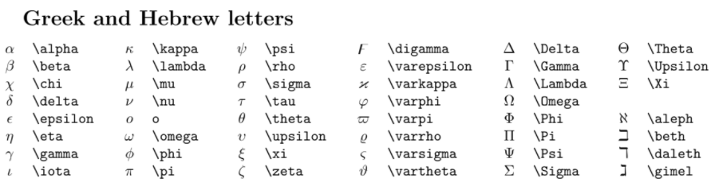

```{r setup, include=FALSE}
knitr::opts_chunk$set(echo = TRUE, 
                      message = FALSE,
                      warnings = FALSE,
                      include_chunk_name = TRUE,
                      eval = T) 
options(show.signif.stars = FALSE)
```

**Before you knit (one-time setup, Console only):**\
If this is your first time knitting on this computer, install the knit tools by running the following code in the **Console** (not in this document):

install.packages("knitr") #Copy, paste, and run this code in the Console below.

install.packages("rstudioapi") #Copy, paste, and run this code in the Console below.

# Writing & Running R Code in R Markdown

R Markdown combines a word processor with **R**. To **write and run code**, you'll first need to insert a **code chunk** using either:

1.  Keyboard shortcut: **Ctrl + Alt + I** (Windows/Linux) or **Command + Option + I** (macOS).
2.  Menu: **Code -\> Insert Chunk**.

Type your code inside the gray chunk. Click the **Run \>** button in the chunk header to execute it, or run one line at a time with **Ctrl + Enter** (Windows/Linux) or **Command + Return** (macOS).

```{r}
# example code chunk
print("Hello, world!")
```

> **Important:** Anything **outside** a code chunk is your written answer or other text. Do **not** type answers inside code chunks.

# File Management

Before you begin, make sure this `.Rmd` and the image **`Greek.png`** are in the **same folder** (in your dedicated Stat 337 folder).\
When you knit, R Markdown uses the **document's folder** as the working directory by default, so you usually **do not need** to change it. However, typically R will set the working directory as the folder the file was initially opened from, so if you first opened this file when it was still in your downloads folder, that's what R will try to use as the working directory. You can check what R currently thinks your working directory is by copy/pasting/running the **getwd()** in the Console.

**Optional:** The chunk below is **commented out** and is **not evaluated**.\
If you want to use it to set your working directory, **remove the `#` in front of the code**, run the chunk, and re-comment it (replace the `#`) if it causes issues.

```{r, eval=FALSE}
# Optional (if needed)

#setwd(dirname(rstudioapi::getActiveDocumentContext()$path))
```

# Question 1

## R as a Calculator

Like most statistical software, **R** can be used as a calculator. In the example below, we compute a simple expression. Text after a pound sign or hashtag (`#`) is a **comment**; use comments to explain what your code is doing so others (and your future self) can follow your work. Commenting your code is an important part of developing good coding habits!

```{r}
11 + (8/2) - 5*2   # quick calculation: 11 + 4 - 10 = 5
```

**You Try!**

Using the directions above for inserting code chunks, **insert a new R code chunk**. In that new chunk:

1.  Type a simple calculation of your choice (you may use +, -, \* `*`, / `/`, and parentheses).\
2.  Add a **comment** on the same line explaining what the code does.\
3.  Run the chunk so the numeric output appears beneath it.

*Note: No starter chunk is provided here - you must insert your own chunk for Question 1.*
```{r}
41 + (8/4) - 5*5  #quick calculation: 41 + 2 - 25 
```

# Question 2

## Creating Variables

In the previous example, the result (5) was **not stored** anywhere; R simply evaluated the expression and printed the answer. Usually, we want to **store results in a variable (object)** so we can reuse them later. Do this with the **assignment operator** `<-`: the **name** goes on the left; the **value/expression** goes on the right.\
In RStudio, you can type `<-` quickly with **Alt + -** (Windows/Linux) or **Option + -** (macOS).

> When you run the chunk below, you won't see printed output because R is storing the value in an object called `x`. You can view the contents of `x` in the **Environment** pane, or print it by typing `x` on its own line.

```{r}
x <- 11 + (8/2) - 5*2   # store the result in a variable named x
```

**You Try!**

In the code chunk below:

1.  Assign **your calculation from Question 1** to a new variable (use any name **except** `x`).\
2.  On the next line, **output the value** by typing the variable's name.

```{r}
y <- 41 + (8/4) - 5*5 #stores the rsult in a variable named y
y #prints the result to the console
```

**Naming tips.** Use short, descriptive names. Valid names use letters, numbers, `_` and `.`; **do NOT start with a number**, and avoid starting with a period (those objects are hidden) or calling your object by something that R already considers a function (like "mean" or "sd"). Additionally, be mindful that R is **case-sensitive** (`avgWt` != `avgwt`).\
Examples: `trout_weight`, `avg_wt`, `sampleMean`.

# Question 3

## Functions

A **function** is a named set of instructions. It takes input values, called **arguments**, applies its rules, and returns an **output**.

**General pattern**

```         
function_name(argument1, argument2, ...)
```

-   Arguments are separated by **commas**.
-   Many functions have **optional** (defaulted) arguments you can explicitly set by **name** (e.g., `digits = 3`).

**Examples**

```{r}
Numbers <- 1:5                      # stores 1, 2, 3, 4, 5

mean(Numbers)                       # function = mean; argument = numbers  -> output: 3

round(pi, digits = 3)               # two arguments, separated by a comma

sort(Numbers, decreasing = TRUE)    # named optional argument controls order
```

**You Try!**

Use `sd()` to compute the **standard deviation** of `Numbers`.\
Add a brief **comment** explaining what your code does, then run the chunk.

```{r}
sd(Numbers) #uses the standard deviation function with the argument Numbers
```

# Question 4

## Packages

Most functions live in **packages**. Packages on the public repository (**CRAN**) install with the code `install.packages()`. Some packages (like **yarrr** and **catstats**) are **not on CRAN** and must be installed from **GitHub**.

### Two ways to install CRAN packages

We'll practice **both methods**--install **tidyverse** via the **Console**, and **mosaic** via the **Packages** tab.

**Method A -- Function (Console, one at a time)**\
In the **Console** (not in this document or a code chunk), type the line below and press **Enter**:

install.packages("tidyverse")

**Method B -- RStudio "Packages" tab (one at a time)**\
1. Open the **Packages** pane -\> click **Install...**\
2. In **Packages**, type: mosaic\
3. Ensure **Install from:** is **Repository (CRAN)** -\> click **Install**.

> **Why installs don't go in your .Rmd code chunks:** knitting (compiling) runs **non-interactively**; `install.packages()` can require prompts (e.g., choosing a CRAN mirror) and therefore often fails during the knitting process. Install using the **Console** (or the Packages tab), then use `library(...)` in the document to access the package.

------------------------------------------------------------------------

### Installing from GitHub (non-CRAN packages)

Use the **remotes** helper to install packages from GitHub. In the **Console**, copy each line **exactly as shown** (no backticks or backslash):

`install.packages("remotes")`\
`remotes::install_github("ndphillips/yarrr", dependencies = TRUE)`\
`remotes::install_github("greenwood-stat/catstats")`

*Alternative method (if needed): using `devtools` -- `install.packages("devtools")` then\
`devtools::install_github("ndphillips/yarrr", dependencies = TRUE)` and\
`devtools::install_github("greenwood-stat/catstats")`

------------------------------------------------------------------------

**You Try!**

1.  Install **tidyverse** in the **Console** (using Method A).\
2.  Install **mosaic** via the **Packages** tab (using Method B).\
3.  Install **remotes** via the Console, then install **yarrr** and **catstats** from GitHub (Console).\
4.  Run the code below to **load** the packages for this lab:

```{r}
library(tidyverse)
library(mosaic)
library(yarrr)
library(catstats)
```

------------------------------------------------------------------------

### Package check (for grading)

The chunk below **does not install anything**. It simply reports whether the required packages are installed so it appears in your knitted document for grading (you do not need to do anything here).

```{r q4_check, echo=FALSE}
pkgs <- c("tidyverse", "mosaic", "yarrr", "catstats")
ok   <- pkgs %in% rownames(installed.packages())
print(data.frame(package = pkgs, installed = ok), row.names = FALSE)
```

# Question 5

## Data Sets

With an understanding of how to install/load packages and use functions, we can start working with data. We can import our own data from a file (typically a .csv) later, or we can use data included with a package. For this lab, we'll use one of the data sets available in the **`car`** package.

**Use the methods from Question 4 to install the `car` package** (Console or Packages tab), then continue.

The code below shows how to find available data sets and how to load and preview the **`Davis`** data frame.

```{r}
# Load the Davis dataset from 'car'
library(car)
data("Davis")

head(Davis, 10)   # first 10 rows
str(Davis)        # variable names and types
```

With a data set picked out, we can start to look at specific variables using the `$` operator. The `$` tells R you want a specific variable from a data object (in this case, the object is `Davis`).

Suppose we're interested in people's actual heights in `Davis`. The example below generates a table of summary statistics for **one variable** using the `favstats` function from the `mosaic` package.

```{r}
library(mosaic)
favstats(Davis$height)
```

**You Try!**

In the chunk below, create a table of summary statistics for **one of the other quantitative variables** in the `Davis` data set (e.g., `weight`, `repwt`, or `repht`).\
Tip: after typing `Davis$`, a list of variable names should pop up.

```{r}
library(mosaic)
favstats(Davis$weight)# your code here
```

# Question 6

## Word Formatting *(graded: the provided image must appear in your knitted document)*

Since we'll be doing a lot of writing in R Markdown, it's important to format your answers clearly. To help distinguish your answers from code and question text, you can **bold** and/or *italicize* your writing.

-   **Bold:** wrap text with two asterisks -- **like this**\
-   *Italics:* wrap text with one asterisk -- *like this*

Pay attention to spacing. Placing a **blank line** between pieces of text starts a new paragraph. You should always have **at least one blank line** between question text, your answer, and any R code chunks.

RStudio has a built-in spell check: **Edit -\> Check Spelling**. Use it before submitting!

------------------------------------------------------------------------

## Writing Equations and Special Characters

To write equations, special symbols, or other notation, use **math mode** by placing content between dollar signs: `$ ... $`.

-   Population mean "mu": `$\mu$` -\> $\mu$\
-   These are **not** R code, so they go in regular text (not inside a code chunk).

------------------------------------------------------------------------

## Subscripts, Superscripts, and Hats

In math mode:

-   **Subscripts:** underscore -- `$\mu_{a}$` -\> $\mu_{a}$\
-   **Superscripts:** caret -- `$x^{2}$` -\> $x^{2}$\
-   **Bars/Hats:** `$\bar{x}, \hat{p}$` -\> $\bar{x}, \hat{p}$
    -   For a word/longer name, `\widehat{...}` works well.

Note: wrap whatever is the subscript/superscript in curly braces ({}), otherwise R will make only the first character a sub- or superscript. Do the same for things under bars or hats.

------------------------------------------------------------------------

## Greek/Hebrew Reference Image *(graded)*

Place the image file **`greek.png`** in the **same folder** as this `.Rmd`. The chunk below will include it in your knitted document. You do not need to change the code.\
**Grading note:** You will be graded on whether this image **appears** in your knitted file.

```{r, echo=FALSE}

```

# Question 7

**You Try!**

Give the difference in sample means between **group 1** and **group 2** in proper notation (translate "x-bar 1 minus x-bar 2" into symbols). Type it in **math mode** on its **own line** (use `$ ... $`) and ensure spacing/formatting is clear.

## example: $\mu_{1}-\mu_{2}$

**$\bar{x}{1} - \bar{x}{2}$**

# Question 8

## Knit to Word, Export to PDF, and Submit to Gradescope *(graded -- no written response required)*

1.  **Spell check** your `.Rmd` (Edit -\> Check Spelling) and make sure to proofread for grammatical/punctuation errors.
2.  **Knit to Word**: Click the down triangle next to **Knit** and select -\> **Knit to Word**.\
    *Do **not** knit directly to PDF!*
3.  **Review the Word file**:
    -   Confirm **all question numbers**, **your written answers**, **code/output**, **plots**, and **equations/notation** appears correctly.
4.  **Export/Save as PDF** from Word. This PDF is what you will upload.

### Upload to Gradescope

-   Upload the **PDF** you exported from Word.\
-   **Assign pages** to each question:
    -   Assign based on **where your solution appears**, not necessarily the start of the prompt.
    -   If a solution spans **multiple pages**, select **all pages** containing that solution.
-   For **Question 8**, you do **not** need to enter any additional content.\
    When assigning pages, **tag the page(s) where this Question 8 section appears**.

### Grading for Q8

You will receive credit for Question 8 if: - The submission is a **PDF exported from Word**. - The PDF clearly shows the **code output and graphs** for earlier questions. - **All questions have pages assigned correctly** in Gradescope (including tagging this Question 8 section).

**Penalty notice:** Labs/homework **not submitted as a PDF** and/or **without pages assigned to each question in Gradescope** will receive a **penalty**.
